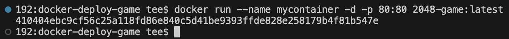
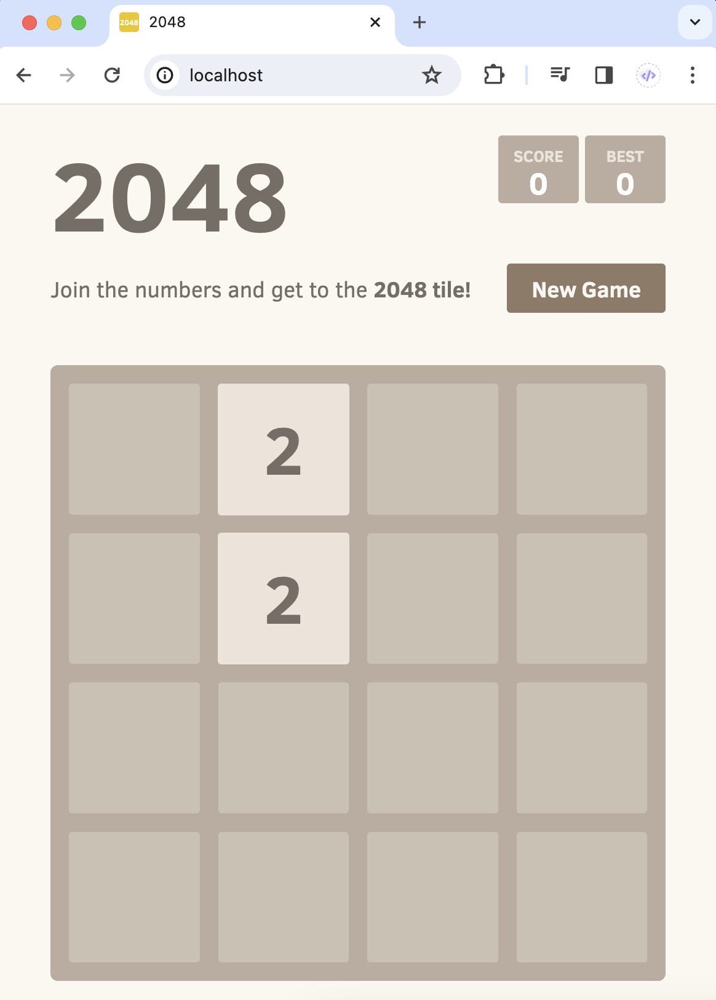
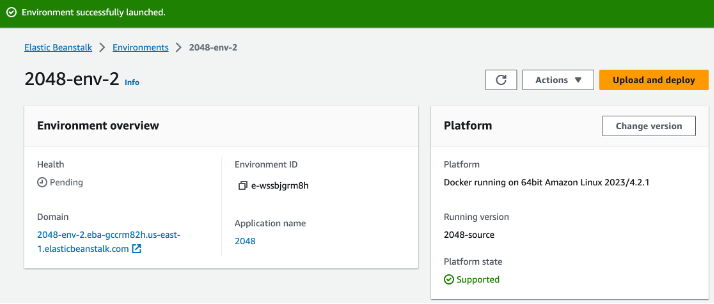
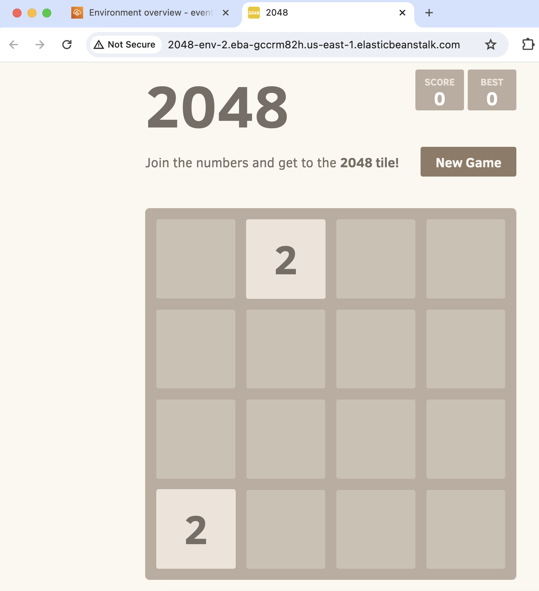

# Deploy a Containerised Game to AWS

This project is based on an [existing application](https://github.com/gabrielecirulli/2048) that serves as the template for my project. The goal is to create a Dockerfile, build a Docker image, run the application in a Docker container, and then deploy the containerised application using the Amazon Elastic Beanstalk service on AWS.

## Runing the Containerised Application

- **Create a Dockerfile:**

    The `curl` command with the `-o` option downloads files directly from a URL without needing to clone the entire repository.


- **Build the Docker image using the provided Dockerfile:**

    ```
    docker build -t [your-image-name] .
    ```

- **Run a container using the Docker image:**

    ```
    docker run --name [container-name] -d -p 80:80 [your-image-name]
    ```
    

- **Access the application in your web browser:**

    In a web browser, enter http://localhost:80.

    

## Deploy the Docker Container on AWS

Deploy the containerised game on AWS using Amazon Elastic Beanstalk (EB), which makes it easy to deploy and manage applications in the AWS cloud.


- Log in to the AWS Management Console.
- Navigate to **Elastic Beanstalk**.
- Create Application.
- Create a new environment.
- Choose Docker as the platform and provide the necessary configuration details.

<br>


## Access Your Application

After the deployment is complete, you can access your application by navigating to the provided URL or DNS endpoint.

